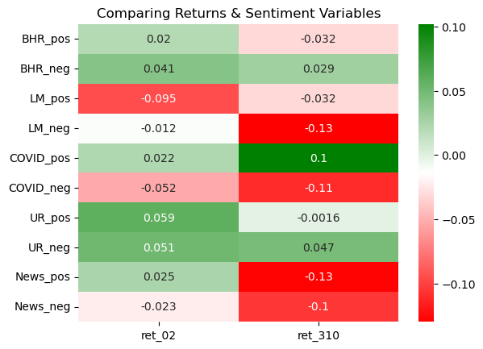

```python
import pandas as pd
import numpy as np
import matplotlib.pyplot as plt
import pandas_datareader as pdr
import seaborn as sns
from  matplotlib.colors import LinearSegmentedColormap

rawsample = pd.read_csv('outputs/analysis_sample.csv')  # importing the file
sample = rawsample.drop(rawsample.index[[0]])           # dropping ticker A
```

# Report

## Summary

This report performs a sentiment analysis on the 10Ks of companies in the SP500 as of 2022 to determine if there is a correlation betweeen sentiment in the 10K and the cumulative returns. This report obtains daily returns and the filing date of the 10Ks to calculate the cumulative returns. To perform the sentiment analysis, lists of positive and negative words were analyzed for different topics. An interesting finding is that the correlation between variables and the two different returns were often different. Additionally, different datasets of positive and negative words yielded different results.

## Data

### What is the sample:

The sample is comprised of 10Ks from SP500 companies. To obtain this data, I read the current SP500 variables from Wikipedia into a .csv. Using the newly created sp500.csv, I then obtained and zipped the 10K files from SEC EDGAR using the `sec_edgar_downloader` package for each company in the SP500.csv.

For each company the cumulative returns (from T0 to T+2 & T+3 to T+10, where T0 is the filing date) were calculated and added to the dataframe. Additionally, positive and negative sentiment variables for 5 topics (for a total of 10 variables) were also calculated and added to the dataframe.

### To determine the return variables:

For the return variables I calculated the cumulative return from T0 to T+2 & T+3 to T+10, where T0 is the filing date. Where $r_t$ is the daily return

$$
\prod_{t = 0}^{t = 2} (1+r_t) - 1 \\
\prod_{t = 3}^{t = 10} (1+r_t) - 1
$$

The daily returns and filing date for each company were needed to calculate the cumulative returns. The daily returns were found in the `crsp_2022_only.zip` file found in the ‘data/Stock Returns (CRSP)/‘ from LeDataSciFi github repo. These were opened and read into a dataframe.

To obtain the filing date, the CIK and Accession Number were needed for each firm. The CIK was found in the sp500.csv while the Accession Numbers were found in the file path to the 10K. While opening the 10K zip files, the file path (‘fpath’) was recorded and from this the Accession Numbers was determined and recorded in the dataframe with the following code: 
```python
accession_number = os.path.basename(os.path.dirname(fpath))
sp500.loc[index,'AN'] = accession_number
``` 

Then, I dropped the rows without an Accession Numbers and named the new dataframe `dsp500`. I used a for loop to loop over the `dsp500` dataframe with`requests_html` and `bs4` packages To get the filing date from SEC EDGAR. I saved the filing date to the according position in the dataframe, similar to the code above. I also added the `sleep(0.5)` here to prevent being kicked out of the SEC website, where I would then have to wait about 10 or more minutes before retrying.

I converted the dates using `pd.to_datetime()` although, this may have been unnecessary. I also renamed the column in `dsp500` from 'Symbol' to 'ticker'. Then, I performed a left merge merging the `dsp500` (the one with the filing date) onto the `returns` dataframe. I dropped the values without a filing date to proceed.

Before I calculated the returns, I added a column to the merged_df which counted the number of business days/instances since the filing date. So the filing date was 0, and each subsequent day was +1 for each ticker. I used a for loop with an if statement to get the correct numbers in the correct row for the returns.

I then filtered the count values when Count >=0 & Count <=2 and Count >=3 & Count <=10. I used gorupby and lambda to then calculate the cumulative returns. The code below is for T0-T2.
```python
# Filter to only include rows where days_since_filing is between 0 and 2
filtered_02 = merged_df[(merged_df['Count'] >= 0) & (merged_df['Count'] <= 2)]
#print(filtered_02)

# Group by ticker and calculate cumulative return
cumulative_returns_02 = filtered_02.groupby('ticker')['ret'].apply(lambda x: np.prod(1 + x) - 1)
#print(cumulative_returns_02)
``` 
I then merged the two cumulative returns into a single dataframe. 


### To determine the sentiment variables:

I needed to obtain 10 sentiment variables from 5 topics, positive and negative for each topic.

Lists of words, 2 topics (LM and ML), 4 lists, were provided. They were the LM and ML lists. Then, I came up with 3 different topics variables. 

The LM and ML lists were provided in the inputs folder of the repository in the form of .csv and .txt files. I read the values into a list. Then, I converted the list in the format that NEAR_regex likes. 

For the two of the three topics I chose, I searched sentiment analysis datasets for COVID-19 and the Ukraine-Russia War. Both of these datasets analyzed twitter feeds and grouped twitter statements as positive, negative and neutral. I then selected three words from the positive and negative datasets for each topic. For my third chosen topic, I looked at financial news headlines from the Wall Street Journal and chose three words. For all of these words/topics, I put them in the format NEAR_regex likes.

To find the fraction of negative and positive variables for the topics, I used the following code below, changing the names accordingly. In the code `BHR_negative_regex` is the list of words properly formatted for NEAR_regex and `clean_len` is the number of words in the 10k. This code below was inserted in the for loop of opening the zip files and places the fraction value in the newly created column in the according row.
```python
BHR_neg = len(re.findall(NEAR_regex(BHR_negative_regex,max_words_between=3),cleaned))
sp500.loc[index,'BHR_neg'] = BHR_neg/clean_len
```
I chose to have the max_words_between to equal 3 in all cases, because when I was reading the some 10Ks, I found that oftentimes the key words were closely associated.

### Why did I chose the 3 topics
I decided to choose COVID-19 because this greatly impacted many companies in 2020 and beyond. It also provided for new technological improvements that we use everyday now. 

I decided to choose the Ukraine-Russia War because it was escalated in 2022. This caused many sanctions to be placed on Russia. Which could have impacted the returns of different companies, since they may have had to alter how they operate.

I wasn’t sure how much the words from the above topics would have affected the returns, therefore I decided to look at Wall Street Journal headlines and I picked some words from there.

### Summary Stats


```python
sample_describe = sample[['ret_02', 'ret_310','10K_#Words', 'BHR_pos', 'BHR_neg', 'LM_pos', 'LM_neg',
       'COVID_pos', 'COVID_neg', 'UR_pos', 'UR_neg', 'News_pos', 'News_neg']].describe().T
sample_describe
```


<div>
<style scoped>
    .dataframe tbody tr th:only-of-type {
        vertical-align: middle;
    }

    .dataframe tbody tr th {
        vertical-align: top;
    }

    .dataframe thead th {
        text-align: right;
    }
</style>
<table border="1" class="dataframe">
  <thead>
    <tr style="text-align: right;">
      <th></th>
      <th>count</th>
      <th>mean</th>
      <th>std</th>
      <th>min</th>
      <th>25%</th>
      <th>50%</th>
      <th>75%</th>
      <th>max</th>
    </tr>
  </thead>
  <tbody>
    <tr>
      <th>ret_02</th>
      <td>490.0</td>
      <td>0.005371</td>
      <td>0.053804</td>
      <td>-0.447499</td>
      <td>-0.022930</td>
      <td>0.002878</td>
      <td>0.030363</td>
      <td>0.348567</td>
    </tr>
    <tr>
      <th>ret_310</th>
      <td>490.0</td>
      <td>-0.007973</td>
      <td>0.065526</td>
      <td>-0.288483</td>
      <td>-0.048347</td>
      <td>-0.008732</td>
      <td>0.029470</td>
      <td>0.332299</td>
    </tr>
    <tr>
      <th>10K_#Words</th>
      <td>490.0</td>
      <td>66372.979592</td>
      <td>29001.266298</td>
      <td>1574.000000</td>
      <td>48681.500000</td>
      <td>62751.500000</td>
      <td>78585.250000</td>
      <td>271718.000000</td>
    </tr>
    <tr>
      <th>BHR_pos</th>
      <td>490.0</td>
      <td>0.023542</td>
      <td>0.004101</td>
      <td>0.003530</td>
      <td>0.021528</td>
      <td>0.023910</td>
      <td>0.025944</td>
      <td>0.037982</td>
    </tr>
    <tr>
      <th>BHR_neg</th>
      <td>490.0</td>
      <td>0.025524</td>
      <td>0.003674</td>
      <td>0.008953</td>
      <td>0.023616</td>
      <td>0.025761</td>
      <td>0.027627</td>
      <td>0.038030</td>
    </tr>
    <tr>
      <th>LM_pos</th>
      <td>490.0</td>
      <td>0.006679</td>
      <td>0.001546</td>
      <td>0.000815</td>
      <td>0.005596</td>
      <td>0.006662</td>
      <td>0.007630</td>
      <td>0.012126</td>
    </tr>
    <tr>
      <th>LM_neg</th>
      <td>490.0</td>
      <td>0.016378</td>
      <td>0.003886</td>
      <td>0.002541</td>
      <td>0.013863</td>
      <td>0.016077</td>
      <td>0.018397</td>
      <td>0.035088</td>
    </tr>
    <tr>
      <th>COVID_pos</th>
      <td>490.0</td>
      <td>0.000006</td>
      <td>0.000016</td>
      <td>0.000000</td>
      <td>0.000000</td>
      <td>0.000000</td>
      <td>0.000000</td>
      <td>0.000165</td>
    </tr>
    <tr>
      <th>COVID_neg</th>
      <td>490.0</td>
      <td>0.000441</td>
      <td>0.000305</td>
      <td>0.000000</td>
      <td>0.000237</td>
      <td>0.000376</td>
      <td>0.000587</td>
      <td>0.001953</td>
    </tr>
    <tr>
      <th>UR_pos</th>
      <td>490.0</td>
      <td>0.000002</td>
      <td>0.000009</td>
      <td>0.000000</td>
      <td>0.000000</td>
      <td>0.000000</td>
      <td>0.000000</td>
      <td>0.000104</td>
    </tr>
    <tr>
      <th>UR_neg</th>
      <td>490.0</td>
      <td>0.000061</td>
      <td>0.000071</td>
      <td>0.000000</td>
      <td>0.000022</td>
      <td>0.000043</td>
      <td>0.000078</td>
      <td>0.000591</td>
    </tr>
    <tr>
      <th>News_pos</th>
      <td>490.0</td>
      <td>0.000623</td>
      <td>0.000394</td>
      <td>0.000073</td>
      <td>0.000347</td>
      <td>0.000528</td>
      <td>0.000812</td>
      <td>0.003043</td>
    </tr>
    <tr>
      <th>News_neg</th>
      <td>490.0</td>
      <td>0.000122</td>
      <td>0.000094</td>
      <td>0.000000</td>
      <td>0.000058</td>
      <td>0.000104</td>
      <td>0.000167</td>
      <td>0.000811</td>
    </tr>
  </tbody>
</table>
</div>


From the summary stats above, the count for all the values is 490. The minimum number of words from the 10K was 1547, while the maximum number of words was 271718.

The standard deviation for both returns is pretty similar, as are their maximum and minimum. It is interesting to note that the returns from T3-T10 have a negative mean and are negative for the first half, while the returns from T0-T2 have a positive mean and are negative for the first quarter. 

The standard deviation for the contextual variables is similar for the 4 given variables and similar for the 3 topic variables, which is expected. Additionally, the minimum for the 4 given variables is above 0, while the minimum for most of the 3 topic variables is 0. The latter was expected, because the 4 given variables have a lot of words, while the 3 topic variables have only 3 words to compare. Additionally, the three topic variables included some words that I wouldn’t expect to find in a 10K such as vaccinated and war.

Not surprisingly, the news positive and negative variables had the highest mean out of the 3 topic variables and `news_pos` variable had the highest max out of the 3 topic variables. Although these were substantially less than the mean for the LM and ML mean and maximums.

### Contextual Sentiment


```python
industry_sentiment = sample[['BHR_pos', 'BHR_neg', 'LM_pos', 'LM_neg',
       'COVID_pos', 'COVID_neg', 'UR_pos', 'UR_neg', 'News_pos', 'News_neg','GICS Sector']].groupby('GICS Sector').agg(['mean', 'std']).T
industry_sentiment
```


<div>
<style scoped>
    .dataframe tbody tr th:only-of-type {
        vertical-align: middle;
    }

    .dataframe tbody tr th {
        vertical-align: top;
    }

    .dataframe thead th {
        text-align: right;
    }
</style>
<table border="1" class="dataframe">
  <thead>
    <tr style="text-align: right;">
      <th></th>
      <th>GICS Sector</th>
      <th>Communication Services</th>
      <th>Consumer Discretionary</th>
      <th>Consumer Staples</th>
      <th>Energy</th>
      <th>Financials</th>
      <th>Health Care</th>
      <th>Industrials</th>
      <th>Information Technology</th>
      <th>Materials</th>
      <th>Real Estate</th>
      <th>Utilities</th>
    </tr>
  </thead>
  <tbody>
    <tr>
      <th rowspan="2" valign="top">BHR_pos</th>
      <th>mean</th>
      <td>2.389691e-02</td>
      <td>0.024608</td>
      <td>2.636332e-02</td>
      <td>0.022910</td>
      <td>0.021140</td>
      <td>0.022229</td>
      <td>0.025067</td>
      <td>0.024723</td>
      <td>0.023348</td>
      <td>0.023472</td>
      <td>0.020057</td>
    </tr>
    <tr>
      <th>std</th>
      <td>2.939153e-03</td>
      <td>0.003976</td>
      <td>3.463975e-03</td>
      <td>0.002153</td>
      <td>0.005266</td>
      <td>0.002837</td>
      <td>0.004441</td>
      <td>0.003038</td>
      <td>0.004191</td>
      <td>0.002035</td>
      <td>0.003854</td>
    </tr>
    <tr>
      <th rowspan="2" valign="top">BHR_neg</th>
      <th>mean</th>
      <td>2.594707e-02</td>
      <td>0.026153</td>
      <td>2.860288e-02</td>
      <td>0.026781</td>
      <td>0.023730</td>
      <td>0.025365</td>
      <td>0.025980</td>
      <td>0.025611</td>
      <td>0.026192</td>
      <td>0.022038</td>
      <td>0.025203</td>
    </tr>
    <tr>
      <th>std</th>
      <td>2.447142e-03</td>
      <td>0.003468</td>
      <td>3.917711e-03</td>
      <td>0.002377</td>
      <td>0.004520</td>
      <td>0.002974</td>
      <td>0.003613</td>
      <td>0.002914</td>
      <td>0.003607</td>
      <td>0.003135</td>
      <td>0.003188</td>
    </tr>
    <tr>
      <th rowspan="2" valign="top">LM_pos</th>
      <th>mean</th>
      <td>6.139994e-03</td>
      <td>0.006789</td>
      <td>7.482718e-03</td>
      <td>0.005664</td>
      <td>0.005958</td>
      <td>0.007613</td>
      <td>0.006999</td>
      <td>0.007173</td>
      <td>0.006633</td>
      <td>0.005703</td>
      <td>0.005291</td>
    </tr>
    <tr>
      <th>std</th>
      <td>1.026764e-03</td>
      <td>0.001518</td>
      <td>1.375560e-03</td>
      <td>0.001205</td>
      <td>0.001472</td>
      <td>0.001419</td>
      <td>0.001534</td>
      <td>0.001391</td>
      <td>0.001341</td>
      <td>0.001141</td>
      <td>0.001048</td>
    </tr>
    <tr>
      <th rowspan="2" valign="top">LM_neg</th>
      <th>mean</th>
      <td>1.562787e-02</td>
      <td>0.016360</td>
      <td>1.677841e-02</td>
      <td>0.015589</td>
      <td>0.017165</td>
      <td>0.018770</td>
      <td>0.016185</td>
      <td>0.017196</td>
      <td>0.014883</td>
      <td>0.013103</td>
      <td>0.013472</td>
    </tr>
    <tr>
      <th>std</th>
      <td>3.617380e-03</td>
      <td>0.002536</td>
      <td>3.951090e-03</td>
      <td>0.002328</td>
      <td>0.005705</td>
      <td>0.003399</td>
      <td>0.003221</td>
      <td>0.003172</td>
      <td>0.002870</td>
      <td>0.003402</td>
      <td>0.003408</td>
    </tr>
    <tr>
      <th rowspan="2" valign="top">COVID_pos</th>
      <th>mean</th>
      <td>2.999916e-06</td>
      <td>0.000005</td>
      <td>4.102861e-06</td>
      <td>0.000003</td>
      <td>0.000001</td>
      <td>0.000014</td>
      <td>0.000014</td>
      <td>0.000004</td>
      <td>0.000001</td>
      <td>0.000004</td>
      <td>0.000002</td>
    </tr>
    <tr>
      <th>std</th>
      <td>1.083327e-05</td>
      <td>0.000015</td>
      <td>9.890967e-06</td>
      <td>0.000008</td>
      <td>0.000006</td>
      <td>0.000022</td>
      <td>0.000026</td>
      <td>0.000009</td>
      <td>0.000004</td>
      <td>0.000008</td>
      <td>0.000005</td>
    </tr>
    <tr>
      <th rowspan="2" valign="top">COVID_neg</th>
      <th>mean</th>
      <td>3.441030e-04</td>
      <td>0.000618</td>
      <td>5.677732e-04</td>
      <td>0.000289</td>
      <td>0.000338</td>
      <td>0.000519</td>
      <td>0.000531</td>
      <td>0.000415</td>
      <td>0.000273</td>
      <td>0.000417</td>
      <td>0.000238</td>
    </tr>
    <tr>
      <th>std</th>
      <td>3.182084e-04</td>
      <td>0.000375</td>
      <td>3.284300e-04</td>
      <td>0.000155</td>
      <td>0.000227</td>
      <td>0.000261</td>
      <td>0.000378</td>
      <td>0.000224</td>
      <td>0.000154</td>
      <td>0.000308</td>
      <td>0.000172</td>
    </tr>
    <tr>
      <th rowspan="2" valign="top">UR_pos</th>
      <th>mean</th>
      <td>7.661831e-07</td>
      <td>0.000003</td>
      <td>6.690666e-07</td>
      <td>0.000000</td>
      <td>0.000001</td>
      <td>0.000003</td>
      <td>0.000002</td>
      <td>0.000002</td>
      <td>0.000002</td>
      <td>0.000002</td>
      <td>0.000000</td>
    </tr>
    <tr>
      <th>std</th>
      <td>3.511092e-06</td>
      <td>0.000009</td>
      <td>3.843495e-06</td>
      <td>0.000000</td>
      <td>0.000005</td>
      <td>0.000014</td>
      <td>0.000013</td>
      <td>0.000008</td>
      <td>0.000010</td>
      <td>0.000006</td>
      <td>0.000000</td>
    </tr>
    <tr>
      <th rowspan="2" valign="top">UR_neg</th>
      <th>mean</th>
      <td>5.326520e-05</td>
      <td>0.000070</td>
      <td>6.391961e-05</td>
      <td>0.000066</td>
      <td>0.000078</td>
      <td>0.000043</td>
      <td>0.000056</td>
      <td>0.000053</td>
      <td>0.000047</td>
      <td>0.000055</td>
      <td>0.000094</td>
    </tr>
    <tr>
      <th>std</th>
      <td>7.569652e-05</td>
      <td>0.000058</td>
      <td>1.070408e-04</td>
      <td>0.000065</td>
      <td>0.000103</td>
      <td>0.000038</td>
      <td>0.000052</td>
      <td>0.000051</td>
      <td>0.000041</td>
      <td>0.000063</td>
      <td>0.000104</td>
    </tr>
    <tr>
      <th rowspan="2" valign="top">News_pos</th>
      <th>mean</th>
      <td>6.095727e-04</td>
      <td>0.000743</td>
      <td>9.914317e-04</td>
      <td>0.000339</td>
      <td>0.000568</td>
      <td>0.000642</td>
      <td>0.000668</td>
      <td>0.000648</td>
      <td>0.000535</td>
      <td>0.000534</td>
      <td>0.000298</td>
    </tr>
    <tr>
      <th>std</th>
      <td>3.320990e-04</td>
      <td>0.000403</td>
      <td>5.586257e-04</td>
      <td>0.000222</td>
      <td>0.000426</td>
      <td>0.000330</td>
      <td>0.000416</td>
      <td>0.000308</td>
      <td>0.000312</td>
      <td>0.000291</td>
      <td>0.000185</td>
    </tr>
    <tr>
      <th rowspan="2" valign="top">News_neg</th>
      <th>mean</th>
      <td>1.155811e-04</td>
      <td>0.000128</td>
      <td>1.097297e-04</td>
      <td>0.000067</td>
      <td>0.000104</td>
      <td>0.000165</td>
      <td>0.000088</td>
      <td>0.000169</td>
      <td>0.000061</td>
      <td>0.000189</td>
      <td>0.000075</td>
    </tr>
    <tr>
      <th>std</th>
      <td>7.856114e-05</td>
      <td>0.000077</td>
      <td>7.621191e-05</td>
      <td>0.000043</td>
      <td>0.000064</td>
      <td>0.000123</td>
      <td>0.000099</td>
      <td>0.000094</td>
      <td>0.000055</td>
      <td>0.000094</td>
      <td>0.000045</td>
    </tr>
  </tbody>
</table>
</div>


The 4 given topics perform as expected, but the 3 chosen topics did not perform as well. There is a lot of variation in the measures for the 4 given topics, but much less so for the 3 chosen topics. This is expected as described in the above section.

When comparing the mean across the board, industries included more negative sentiment compared to a positive sentiment for COVID and the Ukraine Russian War. This was also true for the LM sentiment variables.

The opposite is true for WSJ Financial News headlines, where the industry's more positive sentiment compared to a negative sentiment.

The ML sentiment variables have a very similar mean for both the positive and negative.

Since there were only three words in all of the chosen topics and all industries performed about the same for the topics, it is difficult to determine if a particular industry reacted to a particular sentiment.

### Caveats

In calculating the returns, the count column depends on there being a recording of the return for each business day. If a company didn’t record the daily return on a businesses day that could affect the count, which could affect the cumulative return.

When looking at the 10K for the company with the ticker A, that is not the same company with the ticker A from the SP500 Wikipedia page. Therefore, I dropped that company before doing the final analysis.

## Results


```python
# Isolating the desired columns and preforming a correlation on them
sample_corr = sample[['ret_02', 'ret_310', 'BHR_pos', 'BHR_neg',
       'LM_pos', 'LM_neg', 'COVID_pos', 'COVID_neg', 'UR_pos', 'UR_neg',
       'News_pos', 'News_neg']]
sample_corr = sample_corr.corr()

# Reformating the correlation to a 10x2 matrix
sample_corr_format = sample_corr.loc[['BHR_pos', 'BHR_neg',
'LM_pos', 'LM_neg', 'COVID_pos', 'COVID_neg', 'UR_pos', 'UR_neg',
       'News_pos', 'News_neg'],['ret_02', 'ret_310']]

#Making a heatmap to display the results
color=LinearSegmentedColormap.from_list('rg',["r","w","g"], N=256) 
sns.heatmap(sample_corr_format, annot=sample_corr_format, cmap = color).set(title = 'Comparing Returns & Sentiment Variables')
```


    [Text(0.5, 1.0, 'Comparing Returns & Sentiment Variables')]


    

    


1. Both the LM Sentiment variables (LM_pos and LM_neg) have a negative relationship with the first return variable while both of the ML Sentiment variables (BHR_pos and BHR_neg) have a positive relationship with the first return variable (ret_02). The LM positive has a greater negative correlation compared to the LM negative. While the ML positive has a smaller positive correlation compared to the ML negative.
1. My results for LM positive and negative are very similar to the paper in sign and magnitude for filing period (1), however the results for ML positive and negative differs in magnitude (also in sign for ML negative) for filing period (2). 
    1. For the LM Sentiment that pattern agreed, I believe that they decided to include more rims and years and additional controls to their study to ensure their results are more accurate, and do not vary as much due to a large sample size. The large sample size decreases the impact of a single firm.
    1. For the ML Sentiment, I believe that the additional firms and years added to the study may have affected their return. Since I only looked at the SP500 firms in 2022, perhaps this year was an anomaly which caused our results to be different.
1. From the heatmap it appears that COVID_neg and UR_pos and UR_neg are either +/-0.05 away from zero, which is the largest magnitude for the 3 “contextual” sentiment measures for the first return. Since the correlation is about +/- 0.05, I do not believe it looks “different enough” from zero to investigate further.
1. There is a change in magnitude for both and for BR_pos (ML positive) there is also a change in sign. The overall decrease from r_02 to r_310 for BR_pos (ML positive) is 0.05207 while the overall decrease  for BR_neg (ML negative) is 0.011663. 
    1. I believe this is because over time the return loses value. When looking at the return variable analysis from the table in the summary stats section the mean of r_02 is 0.005371 while the mean of r_310 is -0.007973.
